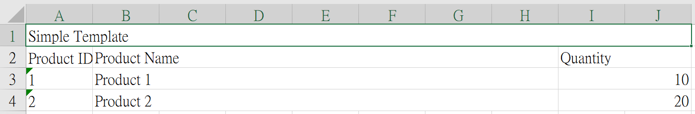

# Excel Pro

## Introduction

Simply define the Excel template using CSV format, and Excel Pro can quickly generate Excel files.
Excel Pro is a Java SDK for exporting Excel files, built on top of [Apache POI](https://poi.apache.org/) and [OpenCSV](https://opencsv.sourceforge.net/). With Excel Pro, you can easily generate Excel files by defining the Excel template using CSV format.

## Syntax

### Basic

| Name      | Syntax                 | Description                                              |
| --------- | ---------------------- | -------------------------------------------------------- |
| Parameter | `{{parameter}}`        | Replaced with parameter value                            |
| Data list | `[[dataListProperty]]` | Generates multiple rows, with dataListProperty as source |

### Styling

| Name                  | Syntax | Description                                                                              |
| --------------------- | ------ | ---------------------------------------------------------------------------------------- |
| Horizontal Merge Cell | `_`    | Merge the specified number of cells, used with `{{parameter}}` or `[[dataListProperty]]` |

## Getting Started

### 1. Add Maven dependency

Add the following Maven dependency to your project:

```xml
<dependency>
    <groupId>com.github.yhao3</groupId>
    <artifactId>excel-gen4j</artifactId>
    <version>1.0.0</version>
</dependency>
```

### 2. Prepare CSV template

Prepare a CSV template and place it under the `resources` directory. The CSV template defines the structure of the Excel file. Here is an example:

-   `simple-template.csv`

    ```csv
    Simple Template__________
    {{bodyHeader1}},{{bodyHeader2_______}},,,,,,,{{bodyHeader3__}}
    [[bodyValue1]],[[bodyValue2_______]],,,,,,,[[bodyValue3__]]
    ```

### 3. Generate Excel file

Use the `ExcelGenerator` class to generate the Excel (`.xlsx`) file. Below is an example code snippet:

```java
void givenSimpleTemplate_whenGenerate_thenSuccess()
    throws IOException, CsvException {
    // Prepare parameters and data list
    Map<String, Object> parametersMap = Map.of(
        "bodyHeader1",
        "Product ID",
        "bodyHeader2",
        "Product Name",
        "bodyHeader3",
        "Quantity"
    );
    List<SimpleTemplateData> dataList = List.of(
        new SimpleTemplateData("1", "Product 1", 10),
        new SimpleTemplateData("2", "Product 2", 20)
    );
    // Use ExcelGenerator to generate Excel file
    ExcelGenerator generator = new ExcelGenerator();
    try (
        SXSSFWorkbook workbook = generator.generate(
            "src/test/resources/simple-template.csv",
            parametersMap,
            dataList,
            SimpleTemplateData.class
        )
    ) {
        FileOutputStream fileOutputStream = new FileOutputStream(
            "src/test/resources/simple-template.xlsx"
        );
        workbook.write(fileOutputStream);
    }
}

```

> **Note**
>
> The `generate()` method returns an [`SXSSFWorkbook`](https://poi.apache.org/apidocs/dev/org/apache/poi/xssf/streaming/SXSSFWorkbook.html) object provided by Apache POI.
> You can write it to a file directly or perform other operations as needed.

### 4. Output

-   `simple-template.xlsx`

    
